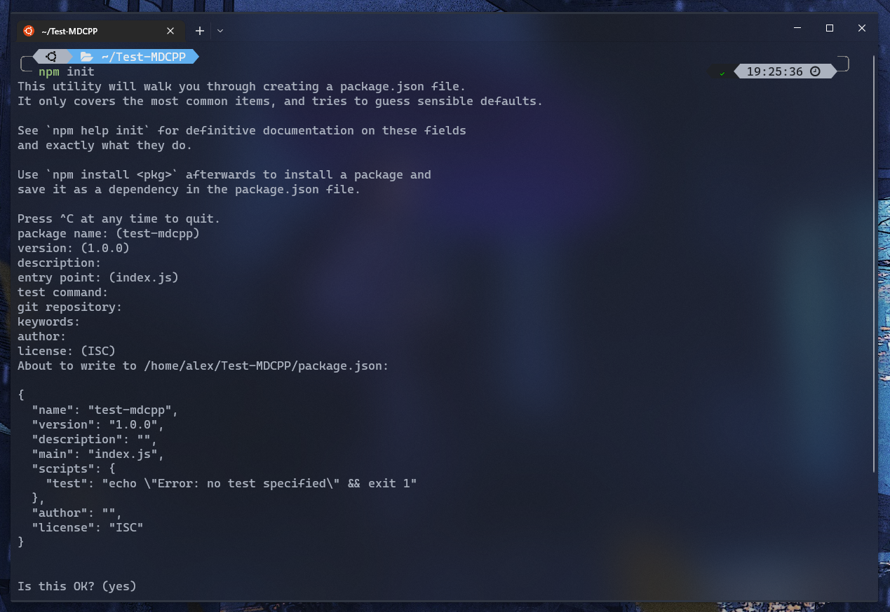
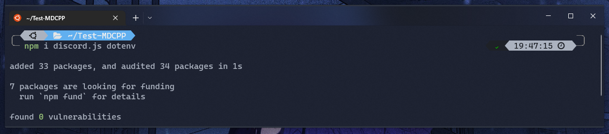
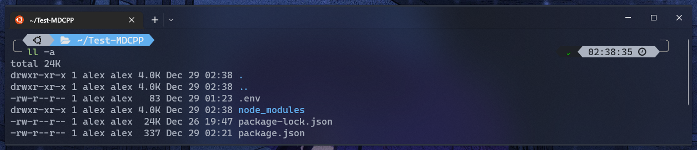
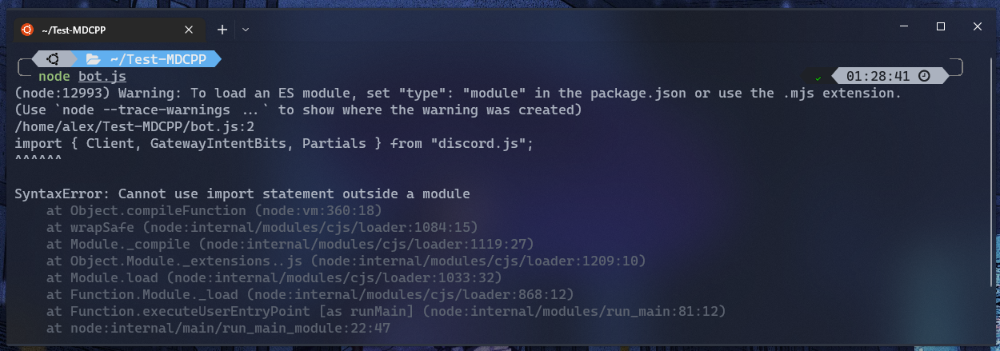
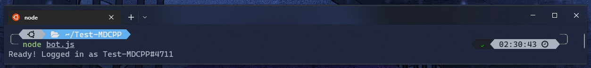

# How to build a discord bot

## Coding time !

### Give your bot a home to live

In order to do that, you can create a folder with the name of your bot.

For example, let's say our bot is called Test-MDCPP, so i create a folder call `Test-MDCPP`.

### Tell computer that the folder is ready to install npm packages

After creating the folder, type the following command in the terminal to tell computer that the folder is ready to install npm packages:

```bash
npm init
```

> Note:
> 
> npm will automatically generate the contents of the `package.json` file. Just keep hitting the enter key and let npm do the rest of the work.

This action will create a file called package.json:



### Create your bot with some magic

To create the bot, we'll need to install a few dependencies.

- doscord.js (The body of the bot)

- dotenv (To grab environment variable)

To install the dependencies, run the following commands in your terminal:

```bash
npm install discord.js
npm install dotenv
```

> Note:
> 
> - The option `install` has several shorthand versions, such as: `add` , `i` , `in` , `ins` , `inst` , `insta` , `instal` , `isnt` , `isnta` , `isntal` , `isntall`.
> 
> - You can also install multiple packages at once by separating them with a space, like this: `npm i package1 package2 package3`.



You can now power up VSCode and create a file called `.env`.

This file will contain environment variables that our bot will use.

In general, the `.env` file contains sensitive data for your project, such as API keys or passwords.

In our case, we'll store the bot's token in this file:

```env
BOT_TOKEN=MTA1MDM4NjkxOTU1MDM3MzkwOA.GxcSLn.h4R7UBzZzikmNvL_ZHlVnv4Hq0x6lZPEbb3uu8
```

> ***WARNING***
> 
> It's important to keep your bot's token private and secure, as it is essentially a password for your bot, Do not share it with anyone else.

---

<h3>Checkpoint✨</h3>
<details>
<summary>Click to expand</summary>
<p>If the above operations are done properly, you will see the following items in the folder:</p>
    <h5>Folders</h5>
    <ul>
    <li>node_modules</li>
    </ul>
    <h5>Files</h5>
    <ul>
    <li>package-lock.json</li>
    <li>package.json</li>
    <li>.env</li>
    </ul>
    
</details>

---

Next, you need to create the main file for our bot.

This is where we'll define the basic behavior of our bot.

To do this, create a new file called `bot.js` and insert the following code:

```js
// Import the necessary classes from the discord.js library
import { Client, GatewayIntentBits, Partials } from "discord.js";
// Import dotenv for loading environment variables
import * as dotenv from "dotenv";


// Load environment variables from .env file
dotenv.config();

// Check if BOT_TOKEN is defined in .env file
if (!process.env.BOT_TOKEN) throw Error("Server : \"BOT_TOKEN\" not found in environment variable");

// Assign value of BOT_TOKEN to a constant
const BOT_TOKEN = process.env.BOT_TOKEN;

// Create a new Discord client with specified intents and partials
export const client = new Client({
    intents: [
        GatewayIntentBits.Guilds,
        GatewayIntentBits.GuildMessages,
        GatewayIntentBits.MessageContent,
    ],
    partials: [Partials.Channel]
});

// When client is ready, log message to console
client.on("ready", async () => {
    console.log(`Ready! Logged in as ${client.user.tag}`);
});

// Log in to Discord with your client's token
client.login(BOT_TOKEN);
```

Then back to terminal, type the following command to run your bot:

```bash
node bot.js
```

WhooHa, then we will get a warning and an error 🤣



Don't be panic, let's break in to the error message and figure out what's going on.

> Before we move on, let's see what an error message will look like.
> 
> Remember, always find the line with colon (`:`) first, it will lead you to the error message.
> 
> This is what error message will look like:
> 
> ```
> <typeOfError>: <reason that cause this error>
> ```
> 
> For example:
> 
> ```
> singingError: can't sing Twinkle Twinkle Little Star because I'm not a child
> ```
> 
> In this case, we can know that error happens when singing Twinkle Twinkle Little Star.
> 
> And the type of the error is `singingError`.
> 
> The error message also contains the reason that cause this error: because he is not a child.
> 
> More details of common error message: [常見的錯誤 ](https://ithelp.ithome.com.tw/articles/10223433)

Back to our code, we can look at the line `SyntaxError: Cannot use import statement outside a module` which contains colon.

Next, let's look at the type of the error:

```
SyntaxError
```

`SyntaxError` will pop out when trying to interpret syntactically invalid code.

For example, accidentally write `=` instead of `==` in judgmental.

Hmm, it seems that the message didn't help much, right?

Let's look at the reason that causes this error.

```
Cannot use import statement outside a module
```

Ah, finally its clear enough for us to understand.

In the code, we are using the `import` statement to import a module. However, Node.js uses the CommonJS module system by default, so we need to specify that we are using the modern module syntax in our code. This can be done by adding `"type": "module"` to `package.json` file.

After fixing the error, run the following command again to start your bot:

```bash
node bot.js
```

If things are going well, you should see `Ready! Logged in as <NameOfYourBot#tag>` in the output of the terminal.


